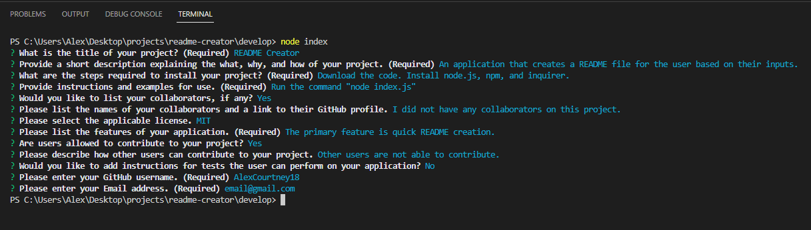

# README Creator

## Description
The application creates a fully functional README for the user based on their inputs and responses to the prompts. The application is run through the console using node.js.
The prompts will ask the user for the necessary information to create a quality README. Once the user has completed the prompts, a new README file is generated is created and stored in the dist file. The README includes a table of contents with anchor links to the various sections of the readme for easier navigation. The README is also generated with a badge for the license selected by the user while completing the prompts.

## Installation
For the application to function, the user will need to download the code from the GitHub repository. The user will also need to have node.js installed along with npm and the inquirer package.

## Usage
With the dependencies installed, the user will open the code in VSC and run the command "node index.js" in their command terminal. This will prompt the user with a series of required and optional questions to populate the README file.
 
 
[demonstration video](LINK)
 
 

 
 

 

